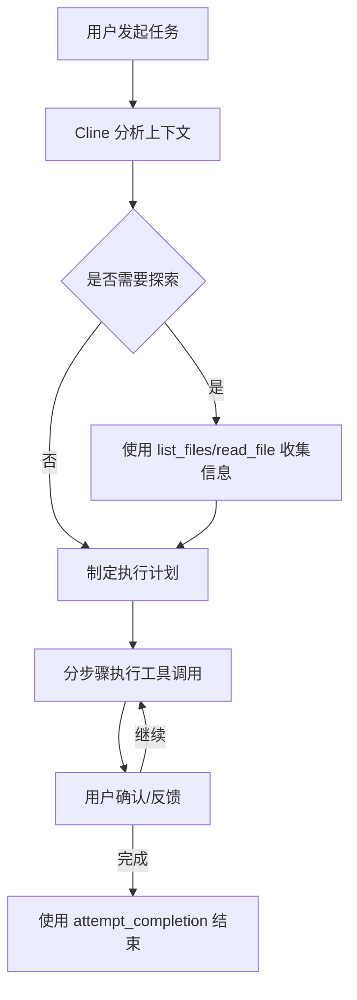

# Cline 完整使用指南与高级技巧

> 本指南基于 Cursor IDE 环境下的 Cline 实践整理，包含官方规范与实战优化技巧

---

## 📑 目录
1. [核心使用流程](#1-核心使用流程)
2. [工具调用规范与技巧](#2-工具调用规范与技巧)
3. [配置文件详解](#3-配置文件详解)
4. [Token 优化策略](#4-token-优化策略)
5. [Skills 工作流](#5-skills-工作流)
6. [模型选择与优化](#6-模型选择与优化)
7. [高级使用技巧](#7-高级使用技巧)
8. [常见问题与排错](#8-常见问题与排错)
9. [最佳实践清单](#9-最佳实践清单)

---

## 1. 核心使用流程

### 1.1 Cline 工作原理
Cline 是 Cursor 内置的 AI 编程助手，采用 **工具优先** 设计哲学，区别于普通聊天式 AI：
- ✅ 拥有文件系统完整访问权限
- ✅ 可以执行系统命令
- ✅ 支持多轮迭代式开发
- ✅ 自动维护上下文与任务进度
- ✅ 支持 MCP 协议扩展能力

### 1.2 标准使用流程


### 1.3 正确发起任务的方式
✅ **好的任务描述**：
```
帮我给登录页面添加忘记密码功能，
1. 增加邮箱输入表单
2. 调用现有 /api/auth/forgot-password 接口
3. 增加成功/失败状态提示
4. 保持现有 UI 风格一致
可以参考 src/pages/Login 下的现有代码
```

❌ **坏的任务描述**：
```
帮我做个登录页
```

### 1.4 两种工作模式
| 模式 | 说明 | 适用场景 |
|------|------|----------|
| **ACT MODE** | 可以执行所有工具操作，直接修改项目 | 实际开发、修改代码 |
| **PLAN MODE** | 只能读取文件、分析、制定计划，不会修改 | 需求分析、方案设计、代码评审 |

> 💡 复杂任务建议先在 PLAN MODE 制定方案，确认后再切换到 ACT MODE 执行

---

## 2. 工具调用规范与技巧

### 2.1 工具优先级顺序
按照推荐程度排序：
1. 🥇 `replace_in_file` - 首选，精确修改指定行
2. 🥈 `read_file` - 读取文件内容
3. 🥉 `list_files` / `search_files` - 探索项目结构
4. `execute_command` - 执行系统命令
5. `write_to_file` - 新建文件或完整重写
6. `ask_followup_question` - 最后选项，尽量先自己探索

### 2.2 replace_in_file 最佳实践
```
✅ 正确用法：
- 只包含需要修改的行 + 上下各1-2行唯一标识
- 一次调用可以包含多个 SEARCH/REPLACE 块
- 按文件中出现顺序排列多个块

❌ 错误用法：
- 匹配半个行
- 包含几十行不变的代码
- 多个块顺序混乱
- 使用缩进不匹配
```

**高级技巧**：
- 如需移动代码：先删除原位置，再插入新位置，两个块
- 如需删除代码：REPLACE 部分留空
- 修改后会自动格式化，以返回的最终内容为准

### 2.3 execute_command 使用规范
```
✅ 安全命令（不需要审批）：
npm run build, npm run dev, ls, cat, git status, test 命令

❌ 需要审批的命令：
npm install, rm, 修改系统配置, 网络操作, 破坏性操作
```

> 💡 长运行命令（如 dev server）会在后台保持运行，Cline 会自动接收输出

### 2.4 工具使用常见误区
1. ❌ 不要同时调用多个工具，每次只做一件事
2. ❌ 不要假设工具执行成功，必须等用户反馈
3. ❌ 不要跳过探索步骤直接修改文件
4. ❌ 不要在需要精确修改时使用 write_to_file

---

## 3. 配置文件详解

### 3.1 全局配置文件位置
| 平台 | 路径 |
|------|------|
| Windows | `%APPDATA%\Cursor\settings.json` |
| macOS | `~/Library/Application Support/Cursor/settings.json` |
| Linux | `~/.config/Cursor/settings.json` |

### 3.2 核心配置项
```json
{
  // Cline 核心配置
  "cline.autoApprove": false,           // 自动审批安全命令
  "cline.maxContextTokens": 131072,     // 最大上下文窗口
  "cline.showTokenUsage": true,         // 显示 Token 消耗
  "cline.enableMcp": true,              // 启用 MCP 协议
  "cline.taskProgress": true,           // 启用任务进度跟踪
  
  // 模型配置
  "cline.defaultModel": "claude-3-5-sonnet",
  "cline.fastModel": "gpt-4o-mini",
  "cline.longContextModel": "claude-3-opus",
  
  // 行为配置
  "cline.autoFormat": true,             // 修改后自动格式化
  "cline.gitCommit": false,             // 自动提交变更
  "cline.dryRun": false                 // 预览模式不实际修改
}
```

### 3.3 项目级配置
在项目根目录创建 `.cursorclinerc` 文件：
```json
{
  "exclude": ["node_modules", "dist", "build", ".git"],
  "include": ["src/**/*.ts", "src/**/*.tsx"],
  "maxFileSize": 102400,
  "filePatterns": {
    "typescript": ["*.ts", "*.tsx"],
    "react": ["*.tsx", "*.jsx"]
  },
  "commands": {
    "build": "npm run build",
    "test": "npm run test"
  }
}
```

---

## 4. Token 优化策略

### 4.1 Token 消耗构成
| 部分 | 占比 | 优化潜力 |
|------|------|----------|
| 文件内容 | 60% | ⭐⭐⭐⭐⭐ |
| 工具输出 | 25% | ⭐⭐⭐⭐ |
| 系统提示 | 10% | ⭐⭐ |
| 对话历史 | 5% | ⭐ |

### 4.2 核心优化技术

#### ✅ 文件级别优化
1. **使用 .clineignore 文件**
   ```
   # .clineignore
   node_modules
   dist
   *.log
   *.md
   package-lock.json
   yarn.lock
   ```

2. **明确指定关注文件**
   ```
   只修改 src/components/Button.tsx 和 src/hooks/useClickOutside.ts
   ```

3. **避免让 Cline 读取大文件**
   > 💡 超过 5000 行的文件会自动截断，主动告知 Cline 只看指定部分

#### ✅ 工具调用优化
1. `list_files` 不要递归全部目录
2. `execute_command` 增加 `--quiet` / `--silent` 标志
3. 长命令输出主动截断：`npm run build | head -50`
4. 不要重复读取相同文件

#### ✅ 任务拆分优化
```
✅ 好的拆分：
任务1：实现 API 接口层
任务2：实现 UI 组件
任务3：添加样式
任务4：编写测试

❌ 坏的拆分：
一次性完成整个模块
```

#### ✅ 高级优化技巧
- 单任务 Token 控制在 60K 以内，超过就拆分
- 复杂任务完成后可以新开对话，不要在一个对话里做太多事
- 定期使用 `@reset` 清空上下文
- 使用 `@file` 显式引用文件而不是让 Cline 自己搜索

---

## 5. Skills 工作流

### 5.1 Skills 是什么
Skills 是 Cline 的可复用能力单元，是预定义的任务处理流程，可以理解为 Cline 的"函数"。

### 5.2 内置 Skills 使用
```
@skill refactor --component Button
@skill add-test --file src/utils/format.ts
@skill fix-bug --pattern "memory leak"
@skill optimize --performance
@skill review --file src/App.tsx
```

### 5.3 自定义 Skill 开发
1. 在项目根目录创建 `.cursor/skills/` 文件夹
2. 创建 `my-skill.md` 文件：
```markdown
---
name: 添加组件测试
description: 为 React 组件添加单元测试
tags: [test, react]
---

# 执行流程
1. 读取目标组件文件
2. 分析组件 Props 和行为
3. 在 __tests__ 目录创建测试文件
4. 使用 @testing-library/react 编写测试用例
5. 运行测试验证
```

### 5.4 Skill 使用最佳实践
- 简单重复任务优先使用 Skill
- 自定义 Skill 放在项目仓库中团队共享
- 可以嵌套调用其他 Skill
- Skill 执行前会先显示预览

---

## 6. 模型选择与优化

### 6.1 各模型适用场景
| 模型 | 最佳用途 | 速度 | 成本 | 上下文 |
|------|----------|------|------|--------|
| Claude 3.5 Sonnet | ✅ 代码编写、重构、复杂任务 | ⚡快 | 💰中 | 200K |
| GPT-4o | ✅ 多模态、UI 实现、视觉理解 | ⚡极快 | 💰中高 | 128K |
| GPT-4o Mini | ✅ 简单任务、格式转换、生成文案 | ⚡极速 | 💰极便宜 | 128K |
| Claude 3 Opus | ✅ 架构设计、疑难问题排查 | 🐢慢 | 💰贵 | 1M |
| DeepSeek V3 | ✅ 长代码库分析 | ⚡快 | 💰便宜 | 128K |

### 6.2 动态模型切换技巧
```
✅ 任务开头指定模型：
使用 gpt-4o-mini 帮我整理这个文档

✅ 中途切换模型：
接下来用 claude 来实现这个算法

✅ 按任务类型自动切换配置：
"cline.modelRouting": {
  "write-code": "claude-3-5-sonnet",
  "explain": "gpt-4o",
  "test": "gpt-4o-mini",
  "debug": "claude-3-opus"
}
```

### 6.3 模型性能优化
1. 简单任务永远用最便宜最快的模型
2. 不要用大模型做小模型能做的事
3. 超过 80K 上下文强制用 Claude
4. 需要速度的时候用 GPT-4o

---

## 7. 高级使用技巧

### 7.1 Memory Bank 用法
在项目根目录创建 `Memory Bank/` 文件夹，Cline 会自动记住这里的内容：
```
Memory Bank/
  ├─ 项目架构.md
  ├─ 编码规范.md
  ├─ API 文档.md
  └─ 常见问题.md
```
> 💡 Cline 会自动读取这个文件夹下所有文件，永远保留在上下文中

### 7.2 快捷指令
| 指令 | 作用 |
|------|------|
| `@reset` | 清空当前任务上下文 |
| `@undo` | 撤销上一步修改 |
| `@status` | 显示当前任务进度 |
| `@tokens` | 显示 Token 使用情况 |
| `@diff` | 显示当前未提交变更 |
| `@plan` | 切换到计划模式 |
| `@act` | 切换到执行模式 |

### 7.3 团队协作技巧
1. 提交 `.cursor/` 配置目录到 Git
2. 统一团队自定义 Skills
3. 共享 .clineignore 文件
4. 约定任务描述格式

### 7.4 Debug Cline 本身
开启调试日志：
```
"cline.debug": true,
"cline.logLevel": "verbose"
```
日志位置：`%APPDATA%\Cursor\logs\cline.log`

---

## 8. 常见问题与排错

### 8.1 replace_in_file 匹配失败
✅ 解决方法：
1. 检查缩进、空格、换行符是否完全一致
2. 减少匹配行数，只保留唯一标识
3. 先读取最新文件内容，不要用缓存的旧内容
4. 考虑到自动格式化可能已经修改了文件

### 8.2 Token 超限错误
✅ 解决方法：
1. 拆分任务为更小的部分
2. 增加 .clineignore 排除不需要的文件
3. 显式指定只需要操作的文件
4. 新开对话

### 8.3 Cline 反复询问同样问题
✅ 解决方法：
1. 明确告诉 Cline "不需要询问，直接按最佳实践处理"
2. 在任务描述中预先说明决策偏好
3. 开启 autoApprove 配置

### 8.4 命令执行没有输出
✅ 解决方法：
1. 检查是否后台进程还在运行
2. 命令增加 2>&1 重定向错误输出
3. 使用 --no-pager 禁用分页

---

## 9. 最佳实践清单

✅ **每次任务前**
- [ ] 明确任务边界和验收标准
- [ ] 排除不需要的文件和目录
- [ ] 选择合适的工作模式
- [ ] 选择合适的模型

✅ **任务执行中**
- [ ] 每次只调用一个工具
- [ ] 等待确认后再进行下一步
- [ ] 保持 task_progress 清单更新
- [ ] 定期检查 Token 消耗

✅ **任务完成后**
- [ ] 验证所有修改正确
- [ ] 运行构建和测试
- [ ] 清理临时文件
- [ ] 使用 attempt_completion 正确结束

✅ **长期优化**
- [ ] 积累项目专属 Memory Bank
- [ ] 编写团队自定义 Skills
- [ ] 持续优化 .clineignore
- [ ] 反馈问题帮助 Cline 改进

---

## 📌 最后建议

Cline 不是魔法，是一个能力强大的合作者。你的任务描述越清晰，边界越明确，Cline 工作的效果就越好。

最好的使用方式是：**你做架构设计和决策，Cline 帮你完成所有重复的编码工作。**

> 本指南会持续更新，欢迎补充实战经验